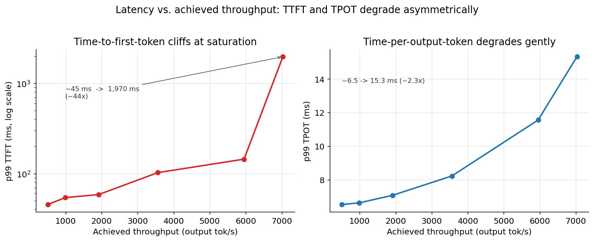
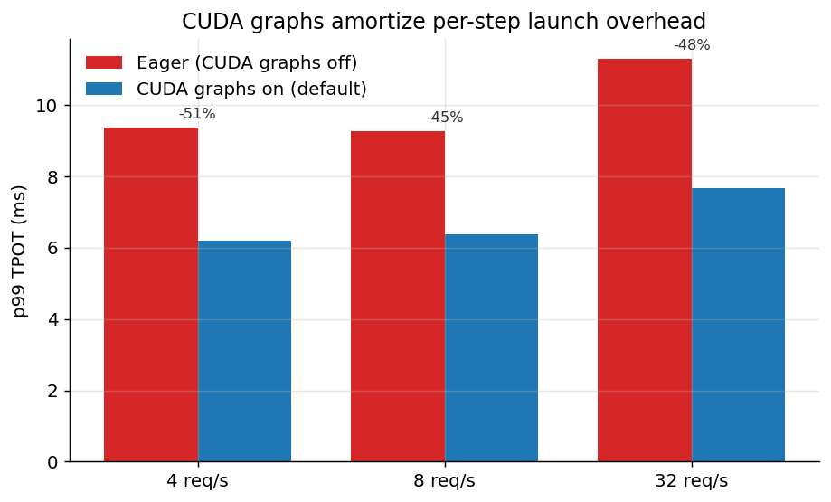
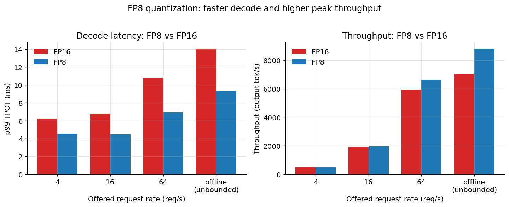
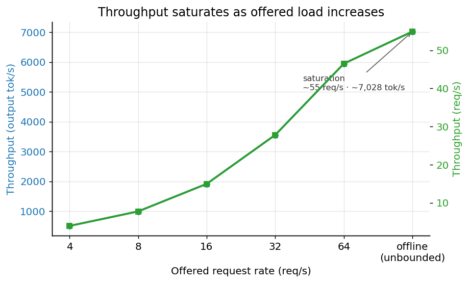

# LLM Inference Benchmarking — Qwen2.5-7B-Instruct on H100 (vLLM)

Profiling LLM inference serving on a single **NVIDIA H100 NVL**: a latency–throughput
characterization, the impact of **CUDA graphs**, and an **FP8 vs FP16** quantization
comparison — each as a clean controlled experiment with honest methodology and reproducible plots.

**Stack:** Qwen2.5-7B-Instruct · vLLM 0.23.0 · NVIDIA H100 NVL (94 GB) · benchmarked with `vllm bench serve` (p99, Poisson arrivals, fixed output length)

---

## Key findings

### 1. Throughput saturates near ~55 req/s · ~7,000 tok/s — and the wall is TTFT, not TPOT

As offered load rises to saturation, the two latency metrics fail **asymmetrically**:

- **p99 TTFT** cliffs from **~45 ms** under light load to **~1,970 ms** at saturation — roughly **44×**.
- **p99 TPOT** over the same range rises only **~2.3×** (6.5 ms → 15.3 ms).

That asymmetry is the headline: once the server saturates, queueing hammers *time-to-first-token*
while *per-token* latency stays well-behaved. The practical consequence is that the serving SLO knee
is set by **TTFT**, so the right operating point is back off the saturation rate to keep first-token
latency in budget. See the full curve in [Results](#results).



### 2. CUDA graphs cut decode TPOT ~45–50%

Comparing the default (CUDA graphs on) against `--enforce-eager` (graphs off) at low-to-moderate
rates, where per-step kernel-launch overhead is a larger fraction of step time:

| Rate (req/s) | TPOT graphs on (ms) | TPOT eager (ms) | Gap (ms) | Gap (%) |
|---:|---:|---:|---:|---:|
| 4  | 6.20 | 9.37 | 3.17 | 51% |
| 8  | 6.39 | 9.27 | 2.88 | 45% |
| 32 | 7.66 | 11.30 | 3.64 | 48% |

Capturing the decode step into a CUDA graph **amortizes per-step launch overhead** across the many
small kernels of a token step, removing ~3 ms of per-token latency — a consistent **45–51%** TPOT
reduction here.



### 3. FP8 gives ~30% faster decode and ~25% higher peak throughput — quality preserved

Running FP8 (`RedHatAI/Qwen2.5-7B-Instruct-FP8-dynamic`) against FP16 on the identical protocol:

- **Decode latency:** FP8 is **~30–35% lower** p99 TPOT across the sweep (e.g. offline: 14.06 → 9.31 ms).
- **Peak throughput:** FP8 reaches **8,810 tok/s** offline vs FP16's **7,028 tok/s** — about **+25%**.
- **Quality:** preserved on real-prompt coherence checks (see [METHODOLOGY](METHODOLOGY.md)), so the
  speedup is end-to-end, not just a microbenchmark win.

The ~30% decode speedup lands **well below the ~2× you'd expect from FP8 matmul alone** — **Amdahl's
law** in action. Decode is memory-bound, and the non-matmul portions of each step (attention over the
KV cache, dequantization, sampling, kernel launches) don't get the 2×, so the achievable speedup is
bounded by the matmul fraction of the step.



---

## Results

Full latency–throughput sweep ([`results/vllm_sweep_qwen7b.csv`](results/vllm_sweep_qwen7b.csv)):

| Offered rate (req/s) | Achieved req/s | Output tok/s | p99 TTFT (ms) | p99 TPOT (ms) |
|---:|---:|---:|---:|---:|
| 4   | 3.94  | 503.73  | 45.26   | 6.52  |
| 8   | 7.74  | 991.03  | 53.99   | 6.62  |
| 16  | 14.96 | 1915.51 | 58.33   | 7.07  |
| 32  | 27.80 | 3558.93 | 102.16  | 8.22  |
| 64  | 46.50 | 5951.47 | 144.15  | 11.55 |
| offline (∞) | 54.91 | 7028.38 | 1970.14 | 15.32 |



FP8 vs FP16 ([`results/fp8_vs_fp16.csv`](results/fp8_vs_fp16.csv)):

| Rate (req/s) | FP16 TPOT (ms) | FP8 TPOT (ms) | FP16 tok/s | FP8 tok/s |
|---:|---:|---:|---:|---:|
| 4   | 6.20  | 4.53 | 503  | 506  |
| 16  | 6.78  | 4.48 | 1916 | 1957 |
| 64  | 10.80 | 6.90 | 5951 | 6645 |
| offline (∞) | 14.06 | 9.31 | 7028 | 8810 |

Raw CSVs for every experiment live in [`results/`](results/); the plots above are regenerated from
them by [`plot_results.py`](plot_results.py).

---

## Reproduce the plots

```bash
python3 -m pip install pandas matplotlib
python3 plot_results.py        # reads results/*.csv, writes PNGs to plots/
```

The benchmark numbers themselves were collected with vLLM's `vllm bench serve` against an
OpenAI-compatible endpoint — see [METHODOLOGY.md](METHODOLOGY.md) for the exact protocol (controlled
single-variable comparisons, p99 reporting, `--ignore-eos` fixed output lengths, Poisson arrivals).

---

## Repository layout

```
.
├── README.md                  # this file — findings, results, plots
├── METHODOLOGY.md             # experimental protocol and principles
├── plot_results.py            # regenerates plots/ from results/*.csv
├── results/
│   ├── vllm_sweep_qwen7b.csv      # latency–throughput sweep
│   ├── cuda_graphs_experiment.csv # CUDA graphs on vs eager
│   ├── fp8_vs_fp16.csv            # FP8 vs FP16 quantization
│   └── trtllm_install_notes.md    # TensorRT-LLM blocker + next-step plan
└── plots/                     # generated PNGs (committed for convenience)
    ├── sweep_saturation.png
    ├── sweep_latency.png
    ├── cuda_graphs_tpot.png
    └── fp8_vs_fp16.png
```

---

## Known limitation / next step

A **TensorRT-LLM** comparison is the planned next step but is **not yet included**. A direct `pip`
install hit CUDA-version library conflicts — which is exactly why NVIDIA ships TensorRT-LLM as a
pre-built NGC container. The next iteration re-runs the FP16/FP8 sweeps inside that container on the
same H100 with the identical protocol. Details: [`results/trtllm_install_notes.md`](results/trtllm_install_notes.md).

## Hardware & software

| | |
|---|---|
| GPU | NVIDIA H100 NVL (94 GB) |
| Model | Qwen2.5-7B-Instruct (FP8: `RedHatAI/Qwen2.5-7B-Instruct-FP8-dynamic`) |
| Serving engine | vLLM 0.23.0 |
| Benchmark tool | `vllm bench serve` (OpenAI-compatible endpoint) |
| Metrics | p99 TTFT, p99 TPOT, throughput (req/s and output tok/s) |

## License

Released under the [MIT License](LICENSE).
